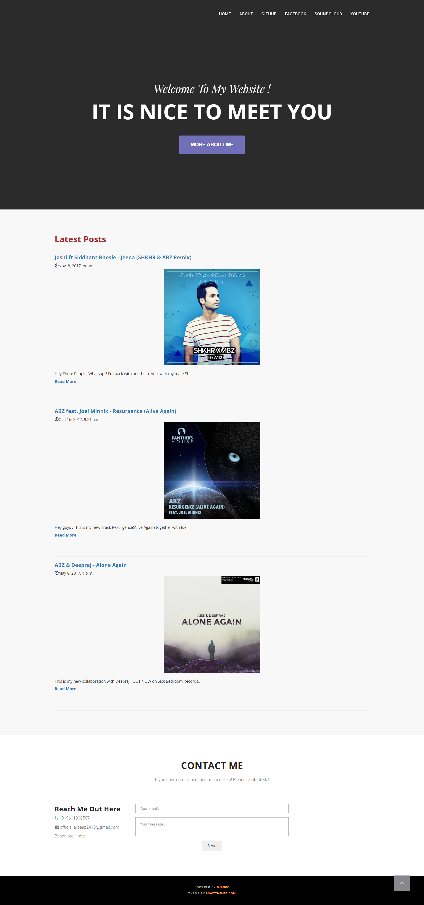
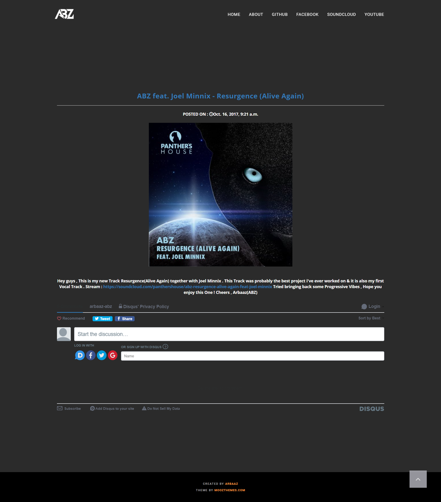

Blog - Website

This is Blog Site made using Django, JS and CSS. I made this is as a part of creating my Artist Brand for my music. 
This projects supports: 
- Adding new Posts
- Allows Users to comment on your posts.

INSTALLATION:
pip3 install django

RUN the project:
git clone https://github.com/arbaaz-abz/Blog-Website
cd Blog-Website
python3 manage.py migrate
python3 manage.py runserver

Enjoy! :)

